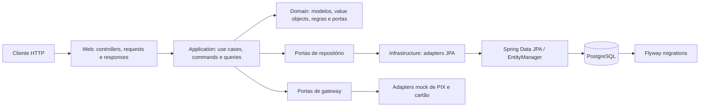

# Arquitetura

O projeto segue uma adaptação pragmática de Clean Architecture. Dependências apontam para dentro: regras de domínio não dependem de Spring, JPA ou HTTP; a infraestrutura implementa as portas definidas pelo domínio.

## Camadas

| Camada | Local | Responsabilidade |
| --- | --- | --- |
| Domain | `domain/` | Entidades imutáveis, value objects, enums, exceções e interfaces de repositório/gateway. |
| Application | `application/` | Casos de uso, comandos, queries, DTOs e validação de orquestração. |
| Infrastructure | `infrastructure/` | HTTP, persistência JPA, adaptadores de integração, configuração Spring e observabilidade. |

### Regras de dependência

- `domain` não importa Spring, JPA ou classes da infraestrutura.
- `application` depende apenas de `domain`; ela opera sobre interfaces de repositório e gateway.
- `infrastructure` depende das duas camadas internas e conecta as implementações ao Spring.
- Controllers convertem request HTTP em command/query e nunca acessam JPA diretamente.

## Persistência e consistência

PostgreSQL é a fonte de verdade. O Flyway aplica migrations versionadas em `src/main/resources/db/migration`; migrations já aplicadas nunca devem ser editadas. O estoque é alterado pela função `registrar_movimentacao_estoque`, que bloqueia o produto durante o cálculo do saldo. A finalização de venda e a movimentação de estoque executam em transação.

Os agregados são persistidos por adapters JPA; as entidades de persistência mantêm IDs relacionais, sem coleções JPA carregadas automaticamente. Isso evita `EAGER` loading e N+1 causado por navegação de associações.

## Observabilidade e erros

`RequestCorrelationFilter` aceita ou gera `X-Trace-Id`, devolve-o na resposta e o insere no MDC. O interceptor HTTP registra método, rota, status e duração. `GlobalExceptionHandler` converte falhas de domínio, validação e persistência no contrato de erro público.
