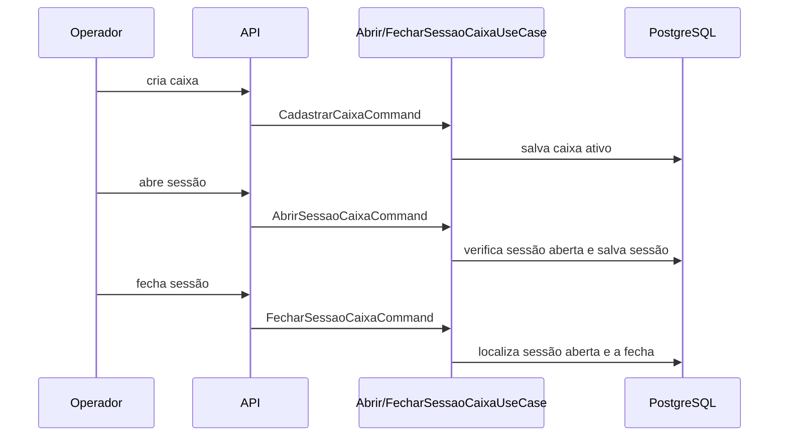

# Fluxos de negócio

## Cadastro e operação de caixa

## Finalização de venda

1. A API valida os campos HTTP, itens e pagamentos.
2. O caso de uso monta os itens e calcula subtotal, quantidade, custo, lucro/prejuízo e total.
3. A soma dos pagamentos precisa ser exatamente igual ao total da venda.
4. A venda é criada em `AGUARDANDO_PAGAMENTO` e os itens são persistidos.
5. O checkout processa dinheiro diretamente, PIX pelo gateway de PIX e cartão pelo gateway de cartão. Respostas não aprovadas interrompem a transação.
6. A venda é atualizada para `PAGA`.
7. Para cada produto vendido, a função transacional do banco registra a saída e atualiza o estoque.
8. Os caches diários do dashboard são atualizados.

Se qualquer etapa falhar, a transação é revertida. Produtos que não pertencem à empresa da venda, estoque insuficiente, parcelamento inválido e pagamento divergente são rejeitados.

## Consulta de dashboard

O dashboard recebe `empresaId`, `lojaId` opcional e `limite` entre 1 e 100. Ele consulta o cache diário, últimas vendas, ranking mensal de produtos e produtos em estoque baixo.
